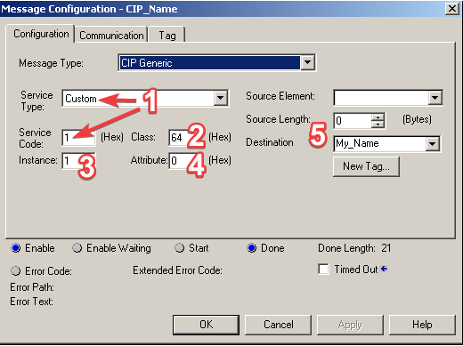
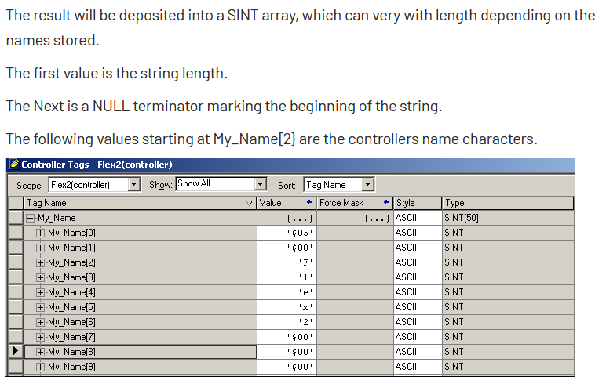

.. py:currentmodule:: pycomm3

===============
Using CIPDriver
===============

The :class:`CIPDriver` is the base class for the other drivers, so everything
on this page also applies to the other drivers as well.

Discovery and Identification
----------------------------

The :class:`CIPDriver` provides to class methods for discovering and identifying
devices. And because they are class methods, they can be used without creating an instance
of a driver first.  The :meth:`CIPDriver.discover` method will broadcast a request for
all devices on the network to identify themselves.  This is similar to how the RSLinx
Ethernet/IP driver works.  It returns a list of dictionaries, where each ``dict`` is the
Identity Object of the device.

>>> from pycomm3 import CIPDriver
>>> CIPDriver.discover()

For example, here is a response with 2 devices discovered:

.. code-block::

    [{'encap_protocol_version': 1, 'ip_address': '10.10.0.120', 'vendor': 'Rockwell Automation/Allen-Bradley',
      'product_type': 'Communications Adapter', 'product_code': 185, 'revision': {'major': 2, 'minor': 7},
      'status': b'T\x00', 'serial': 'aabbcdd', 'product_name': '1763-L16BWA B/7.00', 'state': 0},
     {'encap_protocol_version': 1, 'ip_address': '10.10.1.100', 'vendor': 'Rockwell Automation/Allen-Bradley',
      'product_type': 'Communications Adapter', 'product_code': 191, 'revision': {'major': 20, 'minor': 19},
      'status': b'0\x00', 'serial': 'eeffgghh', 'product_name': '1769-L23E-QBFC1 Ethernet Port', 'state': 3}]

The :meth:`CIPDriver.list_identity` method is similar, but can be used to identify a specific device.
Instead of broadcasting the request to every device, it requires a ``path`` to send the request to.
This ``path`` argument is the same type of CIP path used in creating a driver and detailed in
:ref:`getting_started:Creating a Driver`.

>>> from pycomm3 import CIPDriver
>>> CIPDriver.list_identity('10.10.0.120')
{'encap_protocol_version': 1, 'ip_address': '10.10.0.120', 'vendor': 'Rockwell Automation/Allen-Bradley',
'product_type': 'Communications Adapter', 'product_code': 185, 'revision': {'major': 2, 'minor': 7},
'status': b'T\x00', 'serial': 'aabbcdd', 'product_name': '1763-L16BWA B/7.00', 'state': 0}
>>> CIPDriver.list_identity('10.10.1.100')
{'encap_protocol_version': 1, 'ip_address': '10.10.1.100', 'vendor': 'Rockwell Automation/Allen-Bradley',
'product_type': 'Communications Adapter', 'product_code': 191, 'revision': {'major': 20, 'minor': 19},
'status': b'0\x00', 'serial': 'eeffgghh', 'product_name': '1769-L23E-QBFC1 Ethernet Port', 'state': 3}

Module Identification
^^^^^^^^^^^^^^^^^^^^^

For rack-based devices, the :meth:`CIPDriver.get_module_info` method will return the identity for a ``slot``
in the rack.  This method is *not* a class method, so it does require an instance of the driver to be created.

>>> from pycomm3 import CIPDriver
>>> driver = CIPDriver('10.10.1.100')
>>> driver.open()
>>> driver.get_module_info(0)  # Slot 0: PLC
{'vendor': 'Rockwell Automation/Allen-Bradley', 'product_type': 'Programmable Logic Controller', 'product_code': 51,
'revision': {'major': 16, 'minor': 22}, 'status': b'`\x10', 'serial': '00000000',
'product_name': '1756-L55/A 1756-M13/A LOGIX5555'}
>>> driver.get_module_info(1) # Slot 1: EN2T
{'vendor': 'Rockwell Automation/Allen-Bradley', 'product_type': 'Communications Adapter', 'product_code': 166,
'revision': {'major': 5, 'minor': 8}, 'status': b'0\x00', 'serial': '00000000', 'product_name': '1756-EN2T/B'}
>>> driver.close()

Generic Messaging
-----------------

Generic messaging is a key feature of ``pycomm3``, it allows the user to send custom CIP messages or
implement features not included in one of the drivers.  In fact, many features available in the drivers
are implemented using the :meth:`~CIPDriver.generic_message` method.  This method operates in a similar
way to *CIP Generic* messages in Logix with the ``MSG`` instruction.  For more examples see the
:ref:`examples/generic_messaging_examples:Generic Messaging` section.

To demonstrate how a generic message can be used, below is the process that was used to implement the
:meth:`~LogixDriver.get_plc_name` feature for the :class:`LogixDriver`.

First, the `Obtaining the Controller's Program Name`_ article from the Rockwell Knowledge Base shows
how to configure a ``MESSAGE`` to read the program name from a PLC.  It contains all the information
we need: CIP service, class, instance, etc.

1. The service type is ``0x01``, which is the ``Get_Attributes_All`` service define in the
   *Common Industrial Protocol Specification, Volume 1, Chapter 4: CIP Object Model*.
   See :ref:`cip_reference:CIP Services and Class Codes` for the predefined CIP services,
   classes, and other objects available in ``pycomm3``.  If the service is not already defined,
   you use either an ``int`` or a ``bytes`` string (``0x01``, ``1``, ``b'\x01``).

2. The class code, ``0x64`` is not named in the doc, but is defined as ``ClassCode.program_name``.

3. The instance number of the class we want, ``1``.

4. The attribute is ``0``, so we can ignore it and not set the ``attribute`` parameter.

5. Since we're not in the PLC, we're not storing the response in a tag.  If we set the ``data_type``
   parameter to a :class:`DataType`, that type will be used to decode the response.  Else, the
   raw response ``bytes`` will be returned.

Next, the screenshot below contains enough information for us to determine the data type that can be
used to decode the response.

While the doc doesn't specifically say the response type, it's shows that it is stored in a ``SINT[50]``.
The first two bytes contains the length of the string, which corresponds to a integer(``INT`` or ``UINT``).
Then the string data is stored in the remainder of the array, since PLCs are limited to fixed-size arrays
the destination tag needs to be long enough to contain the maximum size possible.  In Python we do not
have that limitation, but this information tells us that the response is a *string, with 1 byte per character,
and the length of the string is stored in the first 2 bytes*.  That corresponds to the CIP ``STRING``
data type, which is a standard type that is already defined and we can just use.

Taking this information, we were able configure the :meth:`~CIPDriver.generic_message` method to read
the PLC program name:

.. literalinclude:: ../../pycomm3/logix_driver.py
    :pyobject: LogixDriver.get_plc_name

.. tip::

    Setting the ``name`` parameter is helpful because it will be used by the built in logging
    and can help differentiate between calls::

        2021-03-09 18:09:50,802 [INFO] pycomm3.cip_driver.CIPDriver.generic_message(): Sending generic message: get_plc_name
        2021-03-09 18:09:50,802 [VERBOSE] pycomm3.cip_driver.CIPDriver._send(): >>> SEND >>>
        (0000) 70 00 1c 00 00 0b 02 0b 00 00 00 00 5f 70 79 63     p•••••••••••_pyc
        (0010) 6f 6d 6d 5f 00 00 00 00 00 00 00 00 0a 00 02 00     omm_••••••••••••
        (0020) a1 00 04 00 c1 04 35 01 b1 00 08 00 53 00 01 02     ••••••5•••••S•••
        (0030) 20 64 24 01                                          d$•
        2021-03-09 18:09:50,803 [DEBUG] pycomm3.cip_driver.CIPDriver.send(): Sent: GenericConnectedRequestPacket(message=[b'S\x00', b'\x01', b'\x02 d$\x01', b''])
        2021-03-09 18:09:50,807 [VERBOSE] pycomm3.cip_driver.CIPDriver._receive(): <<< RECEIVE <<<
        (0000) 70 00 36 00 00 0b 02 0b 00 00 00 00 00 00 00 00     p•6•••••••••••••
        (0010) 00 00 00 00 00 00 00 00 00 00 00 00 00 00 02 00     ••••••••••••••••
        (0020) a1 00 04 00 4a b7 cb 55 b1 00 22 00 53 00 81 00     ••••J••U••"•S•••
        (0030) 00 00 0c 00 70 79 63 6f 6d 6d 33 5f 64 65 6d 6f     ••••pycomm3_demo
        (0040) 00 00 00 00 02 00 01 00 64 00 02 00 09 00           ••••••••d•••••
        2021-03-09 18:09:50,807 [DEBUG] pycomm3.cip_driver.CIPDriver.send(): Received: GenericConnectedResponsePacket(service=b'\x01', command=b'p\x00', error=None)
        2021-03-09 18:09:50,807 [INFO] pycomm3.cip_driver.CIPDriver.generic_message(): Generic message 'get_plc_name' completed

.. _Obtaining the Controller's Program Name: https://rockwellautomation.custhelp.com/app/answers/answer_view/a_id/23341